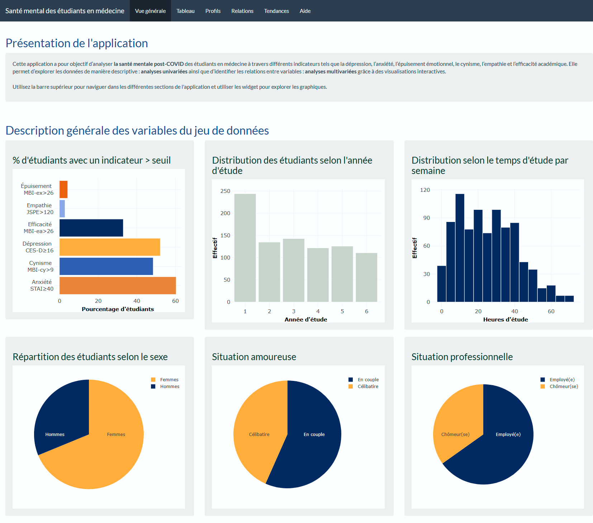
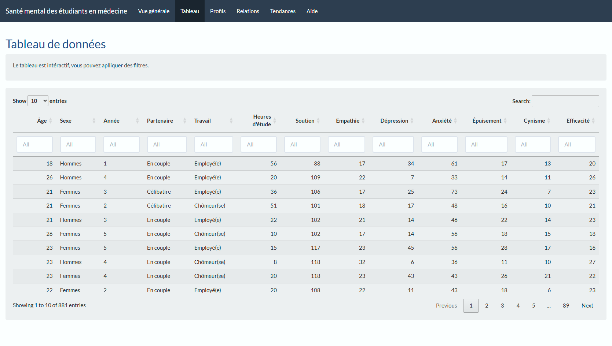
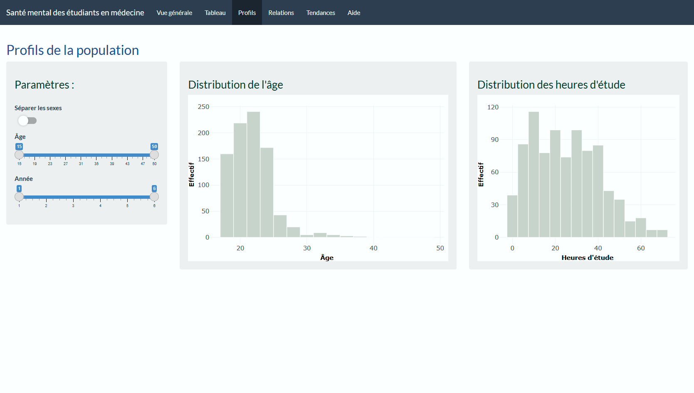
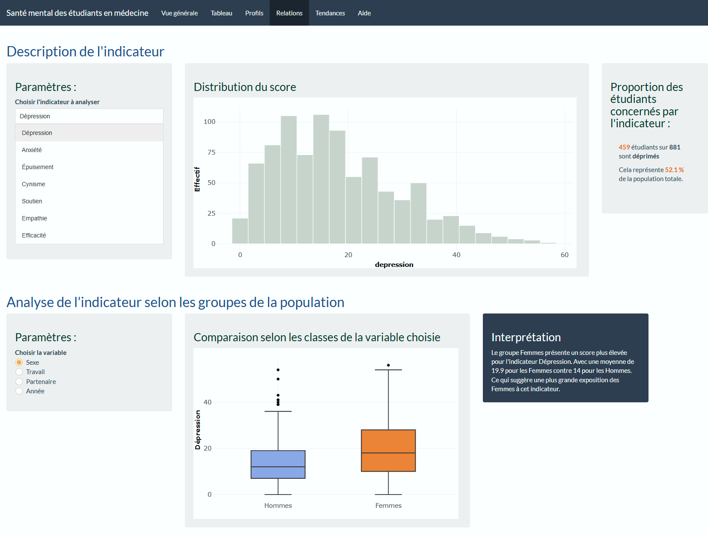
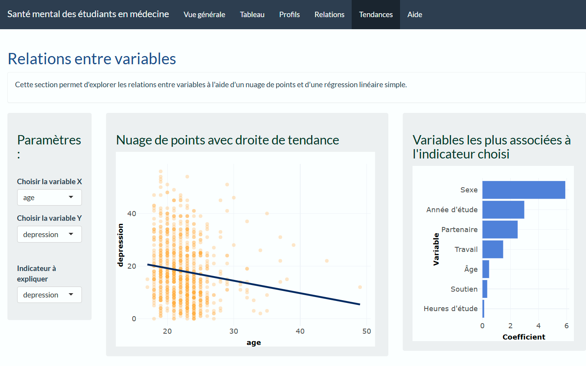
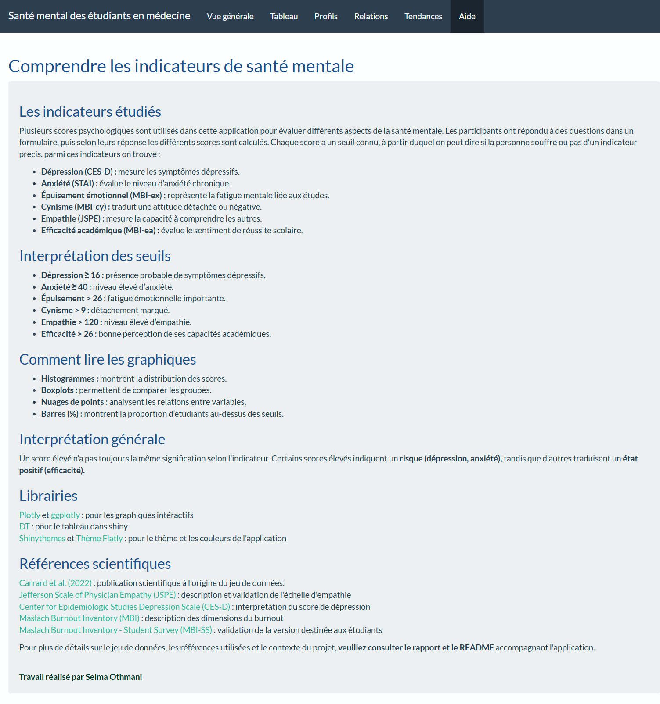

# Medical Student Mental Health Dashboard

**Project Report:**  
https://othmenisalma-cell.github.io/Medical-Student-Mental-Health-Dashboard/Report.html

An interactive dashboard built with **R Shiny** to explore mental health indicators among medical students through descriptive statistics and interactive visualizations.
The dashboard transforms a public health dataset into an intuitive application that facilitates data exploration and supports the interpretation of psychological indicators.

---

## Project Overview

Mental health has become an increasingly important topic in healthcare education, particularly following the COVID-19 pandemic. Understanding how factors such as age, study habits, work status or social support relate to mental health indicators can help identify trends within student populations.
This dashboard provides an interactive environment for exploring these relationships through dynamic visualizations and descriptive analyses.
The project was developed as part of the **Big Data Analytics in Health** program at the **Université de Montréal**.

---

## Dashboard Preview

Click on any screenshot to view it in full size.

<a href="screenshots/overview.png">
  
</a>

| | | | |
|---|---|---|---|
|<a href="screenshots/table.png"></a> | <a href="screenshots/profiles.png"></a> | <a href="screenshots/indicators.png"></a> | <a href="screenshots/relationships.png"></a> | 
<a href="screenshots/help.png"></a> |

---

## Dashboard Features

### Overview

The overview section provides a global summary of the dataset, including:

- distribution of students by year of study
- study hours per week
- demographic characteristics
- percentage of students above established thresholds for major mental health indicators

---

### Interactive Data Table

- searchable dataset
- column filters
- sortable variables
- quick access to all observations

---

### Population Profiles

Explore the characteristics of the study population using interactive filters.
Available variables include:

- age
- sex
- year of study
- study hours

Population distributions can also be compared by sex.

---

### Mental Health Indicators

Explore the distribution of validated psychological scores, including:

- Depression (CES-D)
- Anxiety (STAI)
- Emotional Exhaustion (MBI-EX)
- Cynicism (MBI-CY)
- Empathy (JSPE)
- Academic Efficacy (MBI-EA)

The dashboard also compares these indicators across different population groups using boxplots and automatically generates a brief interpretation of the observed differences.

---

### Relationships Between Variables

Investigate potential associations between variables using:

- interactive scatter plots
- linear regression trend lines

This section supports exploratory analysis and visualization of continuous relationships.

---

### Help Section

A dedicated help page provides:

- descriptions of each psychological indicator
- interpretation thresholds
- guidance for reading the visualizations
- documentation references

---

## Technologies

- R
- Shiny
- ggplot2
- Plotly
- DT
- shinythemes

---

## Skills Demonstrated

This project demonstrates practical experience with:

- Data cleaning and preprocessing
- Interactive dashboard development
- Data visualization
- Exploratory Data Analysis (EDA)
- Reactive programming with Shiny
- Statistical summaries
- Health data analysis
- User interface design
- Scientific data communication

---

## Dataset

The application is based on a publicly available healthcare dataset originally containing data from **886 medical students**.
During preprocessing, one observation with very limited information was removed because it did not provide meaningful analytical value. The final dataset used in the dashboard contains **881 participants**.
The dataset includes demographic variables, lifestyle information and validated psychometric scores measuring mental health, empathy and burnout.
Each observation represents one participant.

---

## Repository Structure

```text
├── ui.R
├── server.R
├── pretraitement.R
├── aide_ui.R
├── donnees_mental_health.csv
├── Codebook.csv
├── Rapport.pdf
├── Screenshots/
└── README.md
```

---

## Running the Application

1. Download or clone the repository
2. Open the project in **RStudio**
3. Run `pretraitement.R` to prepare the dataset
4. Launch the Shiny application by clicking **Run App**

---

## Data Source

Medical Student Mental Health Dataset (Kaggle)

https://www.kaggle.com/datasets/thedevastator/medical-student-mental-health

---

## License

This repository is intended for educational and portfolio purposes.